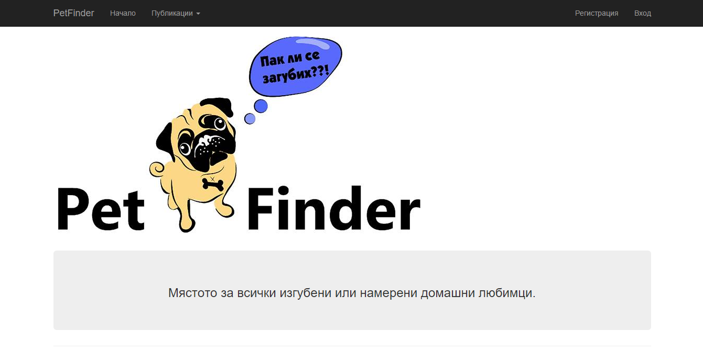
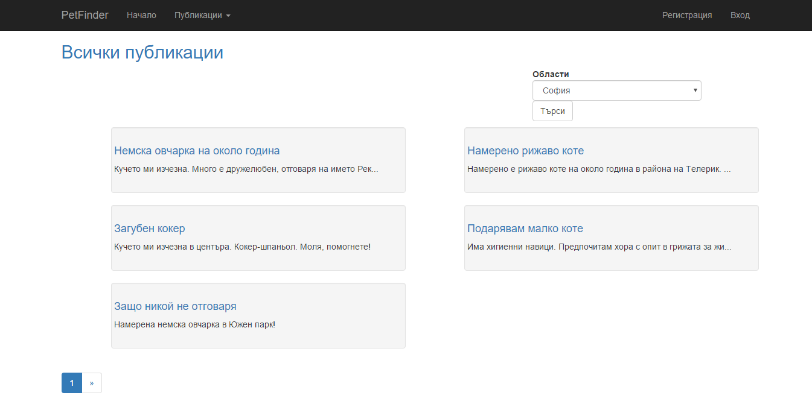
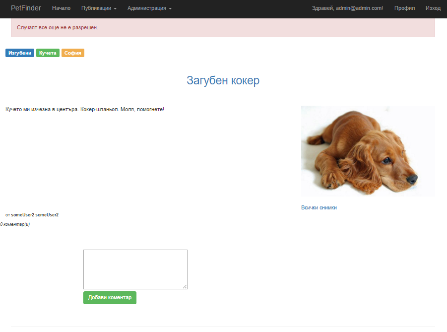
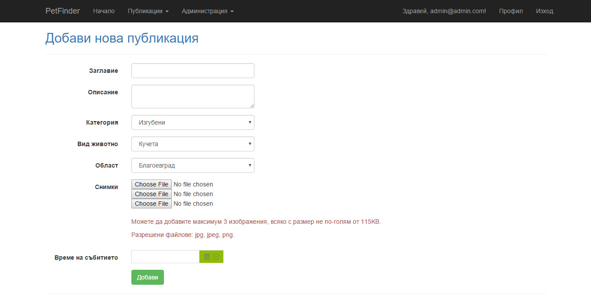
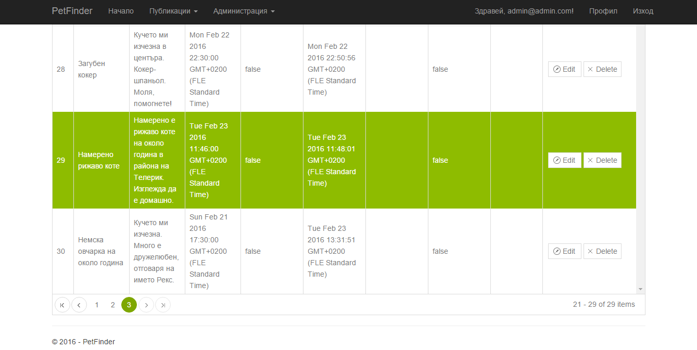

# PetFinder
* PetFinder is an ASP.NET MVC web application created for Telerik Academy. Its main goal is to be the ultimate online place for Bulgaria to search for your lost pet or to tell that you have found someone else's pet. The project's architecture relies heavily upon [Nikolay.IT's template](https://github.com/NikolayIT/ASP.NET-MVC-Template). 
The requirements for the project could be seen [here](https://github.com/TelerikAcademy/ASP.NET-MVC/tree/master/Final%20Project/2016)

## Users
* Guests can view all publications and comments from other users. They can also search for posts by selecting a region (Sofia, Blagoevgrad, etc.).
* Registered users can create new publications, upload images and write comments. Each user has his own private profile page.
* Administrators have the right to create, update, delete posts, comments, categories, etc.

## Routes
* Home
 * Provides some statistics which are cached for a certain amount of time.

* Posts/All
 

* Posts/Details
 

* Posts/Add
 

* Private area for registered users - Profile, MyPosts, MyComments

* Admin panel
 
